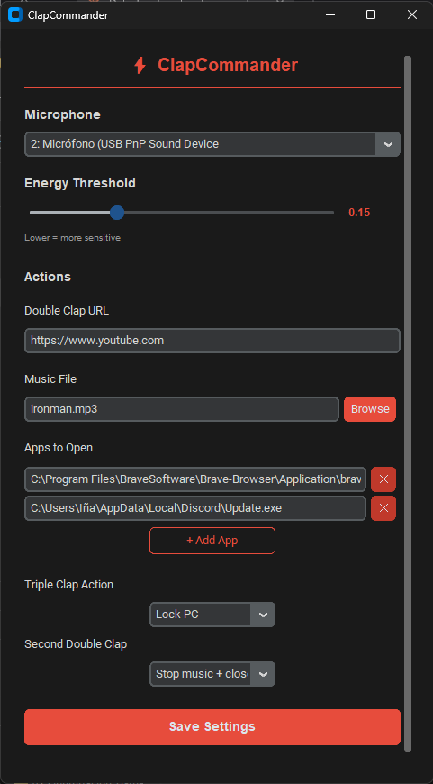

# ClapCommander

Control your PC with claps. No keyboard, no mouse.

## Preview



## Features

- **👏 Double clap** → Opens configured apps + plays music
- **👏👏👏 Triple clap** → Lock PC or mute/unmute (configurable)
- **Second double clap** → Stops music and optionally closes detector
- **🎵 Configurable music** — Pick any .mp3 or .wav file
- **⚙️ GUI settings** — Accessible from system tray
- **🚀 Auto-start** — Runs on Windows boot
- **📊 Auto-calibration** — Measures ambient noise and sets threshold

## Installation

1. Download `ClapCommander.exe` from the [releases](https://github.com/InakiGatica/Ironmanmode/releases)
2. Run it — configure on first launch
3. The app lives in your system tray

## Usage

1. Run the application
2. Stay quiet for 3 seconds during auto-calibration
3. **Double clap** to open apps and play music
4. **Triple clap** to lock PC or mute (based on settings)
5. Use the system tray icon for settings or to quit

## Requirements

- Windows 10/11
- Microphone

## Autostart

To run on Windows startup:

1. Open Task Scheduler (`taskschd.msc`)
2. Create Basic Task → Name: "ClapDetector"
3. Trigger: At log on
4. Action: Start a program → Browse to `ClapCommander.exe`

## Project Structure

```
ClapCommander/
├── main.py              # Entry point
├── gui.py               # CustomTkinter settings window
├── gui_launcher.py      # Standalone launcher for tray
├── actions.py          # App launching, music, lock, mute
├── gesture_engine.py   # Double/triple clap detection
├── listener.py         # Audio input with sounddevice
├── tray.py             # System tray icon
├── settings.py         # Settings management
├── settings.json       # User configuration
├── icon.ico            # App icon
├── ironman.mp3         # Default music file
└── dist/
    └── ClapCommander.exe  # Compiled executable
```

## License

MIT — do whatever you want with it!